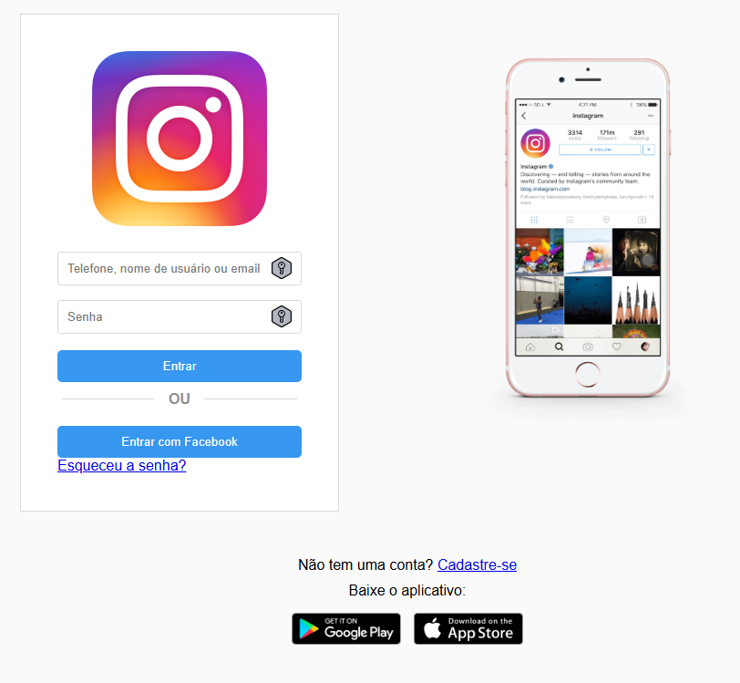

# Recriação da Página Inicial do Instagram

## Descrição do Projeto

Este projeto é um desafio de recriar a página inicial de login do Instagram utilizando **HTML5**, **CSS3** e **Flexbox**. O foco foi em criar uma página **responsiva**, que se adapta a diferentes tamanhos de tela (desktop e mobile), utilizando boas práticas de layout com o Flexbox.

## Estrutura do Projeto

A estrutura do projeto segue a organização de pastas e arquivos conforme abaixo:

L:\VSCode\HTML-CSS\Pagina_Inicial_Instagram
│
├── index.html         # Arquivo HTML da página
├── style.css          # Arquivo CSS para estilização da página
└── assets
    ├── img
    │   ├── logo.png   # Logo do Instagram
    │   ├── promo.png  # Imagem promocional para versão desktop
    │   ├── playstore.png  # Ícone do Google Play
    │   └── appstore.png   # Ícone da App Store

## Tecnologias Utilizadas

1. **HTML5:** Para a estruturação do conteúdo.
    CSS3: Para a estilização e layout.
    Flexbox: Para criar um layout flexível e responsivo.
    Media Queries: Para adaptar o layout a diferentes tamanhos de tela (mobile e desktop).

## Funcionalidades

- **Layout Responsivo:** A página foi projetada para funcionar em telas de diferentes tamanhos.
- **Mobile:** A estrutura de login é centralizada, com os elementos empilhados para uma boa experiência em dispositivos móveis.
- **Desktop:** A imagem promocional é exibida ao lado do formulário de login.
- Formulário de Login:
  - Campos de entrada para "Telefone, nome de usuário ou email" e "Senha".
  - Botão de "Entrar".
  - Opção de "Entrar com Facebook" e link "Esqueceu a senha?".

## Como Executar o Projeto

1. Clonar o Repositório ou baixar os arquivos localmente.
2. Abrir o arquivo index.html em um navegador:
   - Usando o VSCode com Live Server: Clique com o botão direito no arquivo index.html e selecione "Open with Live Server" (caso tenha a extensão instalada).
   - Ou abra manualmente: Navegue até o arquivo index.html e abra-o em qualquer navegador moderno.
3. Visualize a página inicial recriada com responsividade.

## Capturas de Tela

## Possíveis Melhorias Futuras

- Adicionar animações ou efeitos de hover nos botões.
- Melhorar o suporte a acessibilidade (por exemplo, adicionar aria-labels aos botões).
- Implementar a funcionalidade real de login via JavaScript e backend.

## Licença

Este projeto foi desenvolvido como parte de um desafio educacional e é de código aberto.
